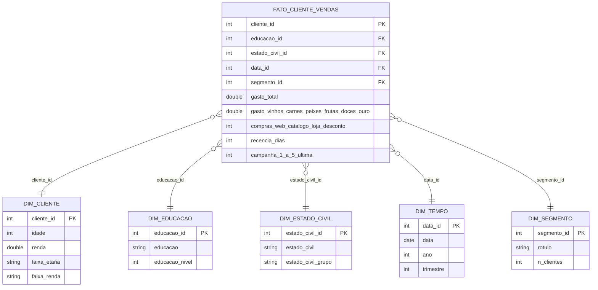

# Diagrama do esquema estrela

```mermaid
erDiagram
    FATO_CLIENTE_VENDAS }o--|| DIM_CLIENTE : cliente_id
    FATO_CLIENTE_VENDAS }o--|| DIM_EDUCACAO : educacao_id
    FATO_CLIENTE_VENDAS }o--|| DIM_ESTADO_CIVIL : estado_civil_id
    FATO_CLIENTE_VENDAS }o--|| DIM_TEMPO : data_id
    FATO_CLIENTE_VENDAS }o--|| DIM_SEGMENTO : segmento_id
    FATO_CLIENTE_VENDAS {
        int cliente_id PK
        int educacao_id FK
        int estado_civil_id FK
        int data_id FK
        int segmento_id FK
        double gasto_total
        double gasto_vinhos_carnes_peixes_frutas_doces_ouro
        int compras_web_catalogo_loja_desconto
        int recencia_dias
        int campanha_1_a_5_ultima
    }
    DIM_CLIENTE { int cliente_id PK
        int idade
        double renda
        string faixa_etaria
        string faixa_renda }
    DIM_EDUCACAO { int educacao_id PK
        string educacao
        int educacao_nivel }
    DIM_ESTADO_CIVIL { int estado_civil_id PK
        string estado_civil
        string estado_civil_grupo }
    DIM_TEMPO { int data_id PK
        date data
        int ano
        int trimestre }
    DIM_SEGMENTO { int segmento_id PK
        string rotulo
        int n_clientes }
```
